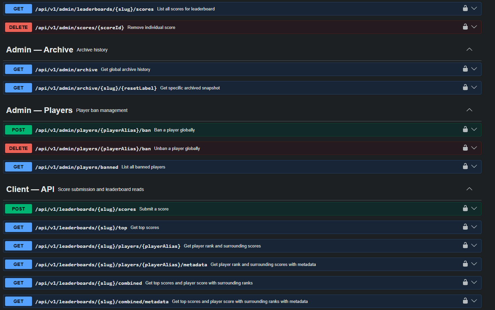

# 🏆 RankDrop

**Self-hosted leaderboard backend for games and apps. Own your data, zero recurring cost.**

Deploy on your own infrastructure in minutes. No pricing per user, no vendor lock-in, no surprises.
Works with Unity (SDK included), Godot(SDK included), or any HTTP client.

---

## Features

- **Multiple leaderboard types** — all-time, daily, weekly, monthly with automatic resets
- **Flexible scoring** — high score wins, lowest time wins, or cumulative totals
- **Concurrent safe** — atomic writes prevent lost updates under load
- **Player moderation** — ban players globally, remove individual scores
- **Webhook notifications** — get notified on Discord or Slack when top scores are beaten
- **Automatic backups** — daily database backups with configurable retention
- **Production ready** — caching, connection pooling, health checks, structured logging
- **Tiny footprint** — GraalVM native image, ~118MB Docker image, ~50ms startup

---

## Quick Start

Requires Docker.

```bash
git clone https://github.com/Brainzy/rankdrop.git
cd rankdrop
cp .env.example .env   # fill in your secrets
docker compose up
```

Swagger UI available at `http://localhost:8080/swagger-ui/index.html`

### Local Development (IntelliJ)

```bash
docker compose up -d postgres   # start PostgreSQL only
# then press Play in IntelliJ
```

### Build & Save Docker Image

```bash
docker compose build rankdrop
docker tag rankdrop-rankdrop-app:latest rankdrop-app:v1
docker save rankdrop-app:v1 -o rankdrop-app-v1.tar
```

### Run Saved Image

```bash
docker load -i rankdrop-app-v1.tar
docker run -d \
  --name rankdrop-app \
  --network your_docker_network \
  -p 8080:8080 \
  -e DB_HOST=postgres \
  -e DB_PORT=5432 \
  -e DB_NAME=rankdrop \
  -e DB_USERNAME=rankdrop \
  -e DB_PASSWORD=rankdrop \
  rankdrop-app:v1
```

Use the SDK for Unity or Godot in your project

- **Unity SDK:** [RankDrop Unity SDK v1.0.0](https://github.com/Brainzy/RankDrop/releases/tag/unity-sdk-1.0.0)
- **Godot SDK:** [RankDrop Godot SDK v1.0.0](https://github.com/Brainzy/RankDrop/releases/tag/godot-sdk-1.0.0)

---

## API Overview



### Client API

| Method | Endpoint                                                     | Description                                                                                  |
|--------|--------------------------------------------------------------|----------------------------------------------------------------------------------------------|
| `POST` | `/api/v1/leaderboards/{slug}/scores`                         | Submit a score                                                                               |
| `GET`  | `/api/v1/leaderboards/{slug}/top`                            | Get top N scores. Param: `limit` (default 10)                                                |
| `GET`  | `/api/v1/leaderboards/{slug}/players/{playerAlias}`          | Player rank and surrounding scores. Param: `surrounding` (default 0)                         |
| `GET`  | `/api/v1/leaderboards/{slug}/players/{playerAlias}/metadata` | Same as above with metadata included                                                         |
| `GET`  | `/api/v1/leaderboards/{slug}/combined`                       | Top scores + player context in one request. Params: `topLimit`, `playerAlias`, `surrounding` |
| `GET`  | `/api/v1/leaderboards/{slug}/combined/metadata`              | Same as above with metadata included                                                         |

### Admin API

| Group        | Description                                          |
|--------------|------------------------------------------------------|
| Leaderboards | Create, configure, reset, delete                     |
| Players      | Ban, unban, list banned players                      |
| Scores       | View all scores, remove individual entries           |
| Settings     | Rotate game key, configure webhooks, backup settings |
| Archive      | View reset history and archived snapshots            |

Full interactive documentation at `/swagger-ui/index.html`.

---

## Tech Stack

| Layer      | Technology                           |
|------------|--------------------------------------|
| Runtime    | Java 25, Spring Boot 4.x             |
| Native     | GraalVM native image (~50ms startup) |
| Database   | PostgreSQL                           |
| Migrations | Flyway                               |
| Docs       | OpenAPI 3 / Swagger UI               |
| Deployment | Docker, Docker Compose               |

---

## Deployment options

| Path                                 | Deploy   |  Total      |
|--------------------------------------|----------|	------------|
| Manual self-host                     | ~60 min  | ~1 hour 	|
| RankDrop Unity Asset                 | included |  60 seconds |
| Godot RankDrop deploy                | included | 60 seconds  |
| TurnKit hosted leaderboards          | included | instant     |

The manual path is free and fully documented below. If you'd rather skip the hour, use the links bellow to deploy in 60 seconds to Unity or Godot. 
You can also use TurnKit hosted leaderboards with free up to 20CCU.

- 🎮 **[Unity Asset Store](https://assetstore.unity.com/packages/tools/integration/rankdrop-leaderboards-in-60-seconds-366688)**
- 🕹️ **[Godot deploy asset](https://brainzy.itch.io/godot-rankdrop-leaderboards-in-60-seconds-no-monthly-costs-and-own-your-data)**
- ☁️ **[TurnKit.dev](https://turnkit.dev)**

RankDrop is also the leaderboard foundation of **[TurnKit](https://turnkit.dev)** — a multiplayer backend for
turn-based games including authorative relay with matchmaking.

---

## Hosting

RankDrop is designed to run free or near-free on:

| Provider                   | Notes                                                                                                                                                                       |
|----------------------------|-----------------------------------------------------------------------------------------------------------------------------------------------------------------------------|
| **Koyeb + Aiven**          | Koyeb runs RankDrop on 512MB RAM, Aiven provides free managed PostgreSQL. Both have free tiers. App sleeps after 60 min inactivity (~3s wake time). Easiest starting point. |
| **Oracle Cloud Free Tier** | 4 OCPU, 24GB RAM — handles serious player counts for free. No sleep. Signup can be painful but worth it if you outgrow Koyeb.                                               |
| **Any VPS**                | Hetzner, DigitalOcean, Fly.io — RankDrop is a single Docker container, runs anywhere.                                                                                       |

Deploying on a VPS or Oracle Cloud? We recommend [Caddy](https://caddyserver.com) as a reverse proxy for automatic
HTTPS — not needed on Koyeb which handles it automatically.

> Hosting providers control their own pricing and free tier terms. RankDrop itself is always free and open source.

---

## Further Reading

- **FEATURES.md** — full breakdown of implemented and planned features
- **ARCHITECTURE.md** — technical design decisions and rationale

---

## License

Apache 2.0 — see [LICENSE](LICENSE) for details.

---

## Part of TurnKit

RankDrop is the leaderboard module powering **[TurnKit.dev](https://turnkit.dev)** — backend for turn-based
multiplayer games. Relay, matchmaking, and leaderboards, all free up to 20CCU.

[Sign up at TurnKit.dev →](https://turnkit.dev)
